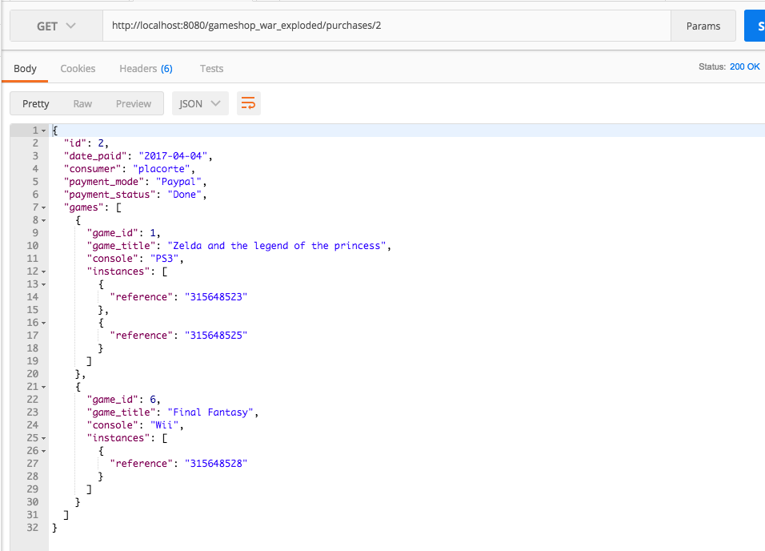

# SR03 Web project: Video games website

> The purpose of this project is to design a basic commercial site for video games.

In order to realize the project, we spent some time designing the website and the database. Here are the different stages of the conceptualization of the project

## First thoughts

- UML of the project:


- Relational modelization of the project:
Data types used in the project: `PaymentMode, PaymentStatus, GameType`

```
GameConsole (#name: string, releasedate: string)
Game (#title: string, date: string, stock: integer, price: float)
GameSupport (#name=>Console, #title=>Game)
Purchase (#id: integer, mode: PaymentMode, username=>Customer, status: PaymentStatus, date_paid: string) 
ContentPurchase (#id=>Purchase, #title=>Game, copies: integer) // copies is the number of instances of a game that are in the same cart
Customer (#username: string, password: string, firstname: string, lastname: string, birthdate: string, subscriptiondate: string)
```

## Modifications

- UML of the project:


- Relational model:
```
PaymentMode (#mode: string)
PaymentStatus (#status: string)
Customer (#username: string, password: string, firstname: string, lastname: string, birthdate: string, subscriptiondate: string, email: string, isActive: boolean) with the methods: isBirthday(), age(), login(), register() and udpateProfile()
Purchase (#id: integer, mode=>PaymentMode, username=>Customer, status=>PaymentStatus, date: date, totalprice: float, totalarticles: int) with mode, status, username, date, totalprice and totalarticles NOT NULL 
GameConsole (#name: string, release_date: string, model: string, description: string, storage: int)
Game (#id: int, title: string, console=>GameConsole, ageLimit: integer, price: float, releasedate: date, description: string, rate: float) with title and console UNIQUE and NOT NULL, and price NOT NULL
GameEntity (#serial_number: string, game_id=>Game, purchase_id=>Order) with game_id NOT NULL. Note: order_id can be empty if the game has not been bought yet
GameKeyword(#word: string)
Characterize(#word=>GameKeyword, #game_id=>Game)
```

## Final version of UML

- UML:


### Explanations of our model

- We decided to split the games into 2 classes: Game and GameEntity. In fact, those classes correspond to 2 levels of conception. The class Game can be seen as a meta-level class which represents a game in general. Thus a game is just a name and a release date. However, the class GameEntity is a "lower level" class which aims to represent specific games identified by reference names (ids/serial numbers). Indeed, it might be useful to be able to act at 2 different scales: One scale to know which games are identified/available on the store (this would be represented by the class Game); the second use case would be to knwo which specific game of the stock a user is buying (need to use the class GameEntity). Additional information about games are present in the association class between Game and GameConsole since we considered that the price of a game and its release date could vary from one console to another (ie: Call of Duty might have been published in August 2016 on PS3 and might have cost 50€ while it might have been published in January 2016 on XBOX360 for 70€)

We thought that such an organisation would enables us to be able to think at 2 levels (meta level and micro level) and would lead to more flexibility of the architecture

- We decided to move from enumerations to tables for `PaymentMode`, `PaymentStatus`, `GameKeywords` to make it easier to maintain. Indeed if we need to add a payment mode because we developed a new feature that enables that, we now need to do an INSERT request to insert the new payment mode in the table `PaymentMode`. This is more flexible than just drop the enumeration and create it again (same thing for other enums that became tables in the scheme).

- We decided to use GameKeywords to associate a game with a list of keywords that would help us in applying filters and so on (possible feature)

- A customer has a birthdate and a subscription date because we thought that it would be nice to have the birthday of a customer if we wanted to implement a feature that would apply some discount on video games if it is the birthday of the logged in customer. Moreover, having the subscription date is always good since it could help us establishign statistics (how many customers created an account between the date X and the date Y ? and so on..). Last, thanks to the age of the customer (calculated from the current date and the birth date of the customer) we can decide WHETHER we display certain types of games OR NOT. For instance, if a game has an ageLimit = 18 (maybe a violent game), and a customer aged 14 looks for this game then a page can just say "sorry you cannot access this content", or something like that.


### Access Data from REST Webservice

We decided to create for each Java Beans file an other file which enable us to access data from the corresponding table. However this specific file has `Path` in is name to differenciate it.
As an example: 
- Data from `Customer` is accessible from `CustomerPath`.

`XXXXXXPath` files have the same structure : 
- a get method which returns all data from a table of the database 
- a second get method which returns specific element from a table of the database. We get parameters from QueryParam. Each parameter is optional.

#### Customers

##### List of customers (with optional parameters)
* Endpoint:
```
/customers
```

* Query parameters:
  - isActive

Example of request/response:


##### One specific customer
* Endpoint:
```
/customers/{username}
```

Example of request/response:


#### Games

##### List of games (with optional parameters)
* Endpoint:
```
/games
```

* Query parameters:
  - rate
  - priceMin
  - priceMax
  - console
  - age
  - type

Example of request/response:


##### One specific game
* Endpoint:
```
/games/{id}
```
Example of request/response


#### Consoles

##### List of consoles (with optional parameters)

* Endpoint:
```
/consoles
```

Example of request/response:


##### One specific console
* Endpoint:
```
/consoles/{name}
```
Example of request/response


#### Purchases

##### List of purchases (with optional parameters)

* Endpoint:
```
/purchases
```

* Query parameters:
  - username
  - mode
  - status
  - date

Example of request/response:


##### One specific purchase
* Endpoint:
```
/purchases/{id}
```
Example of request/response


#### Keywords

##### List of keywords

* Endpoint:
```
/keywords
```

Example of request/response:


#### PaymentStatus

##### List of paymentStatus

* Endpoint:
```
/paymentStatus
```

Example of request/response:


#### PaymentModes

##### List of paymentModes

* Endpoint:
```
/paymentModes
```

Example of request/response:


## Notes about the API responses

- The HTTP header is set to 206 (Partial content) if the response contains only a page of all results
- The HTTP header is set to 200 if the response contains either the last page of results or the total number of results
- The HTTP header is set to 500 in case of internal error, and the response body is empty
- The pagination field is included in every reponse containing a list of resources and is built by a pagination manager

## Security

In order to have an application as secure as possible we decided to:
- Use the "setParameter" provided by hibernate. That way the web application is secure against SQL injections
- Change the default configuration of the database server (psql). We changed the default por number to prevent any direct attack from someone who guessed the architecture of the application. To do so, we did:
  - vi /usr/local/var/postgres/postgresql.conf (and change the default port number to 2472 for instance)
  - brew services restart postgresql
  - Update the hibernate configuration:
    - In InteliJIDEA:
      - Update the URL of the database in the configuration and the hibernate.cfg.xml file with `jdbc:postgresql://localhost:2472/sr03`

